# **TakeMyTickets Task 3: IBM Stock Analysis Dashboard**

## **Purpose**
This project is a dynamic and interactive dashboard built to analyze **IBM's intraday stock data** using **real-time 5-minute intervals**. It offers powerful data visualizations to assist users in understanding stock price trends, trading volumes, and key correlations. This dashboard is part of an internship task for **TakeMyTickets**.

## **Features**
### **1. Interactive Dashboard**
- Displays a user-friendly interface with **light and dark theme** support.
- Provides insights into IBM stock data with advanced **Chart.js** visualizations.

### **2. Visualizations**
- **Bar Chart**: Displays the closing price for recent stock data intervals.
- **Scatter Plot**: Highlights volume trends across time.
- **Line Chart**: Tracks price movements over time.
- **Doughnut and Polar Area Charts**: Analyze trading volume distributions.
- **Bubble and Radar Charts**: Reveal multi-variable correlations and comparisons.

### **3. Data Source**
- Powered by **Alpha Vantage** API, providing real-time stock data.

### **4. Responsive Design**
- Ensures compatibility with devices of all screen sizes, from desktops to mobiles.

## **Technologies Used**
- **Frontend**: React.js, TailwindCSS for styling, Chart.js for visualizations.
- **Backend**: Node.js for fetching stock data.
- **API**: Alpha Vantage for real-time IBM stock data(demo version).

  ## **Screenshots**
Here are some screenshots demonstrating the dashboard:

### **Home Page**
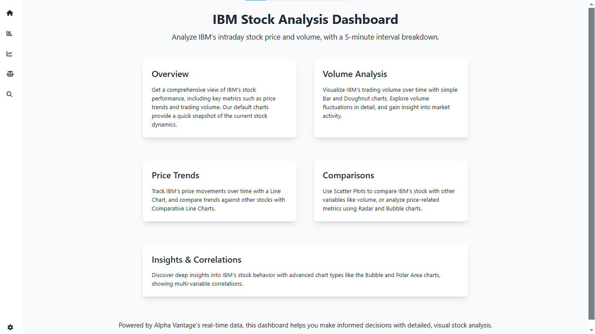  
*The homepage with the light theme, providing a comprehensive introduction to the stock analysis features.*

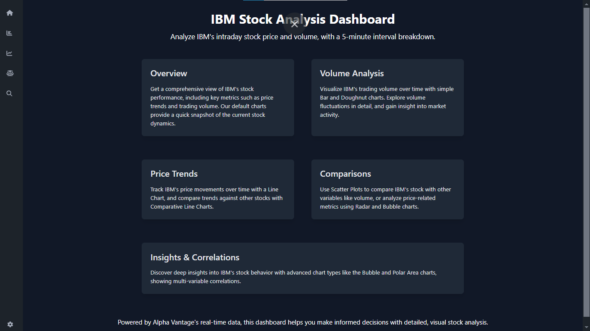  
*The homepage with the dark theme.*

### **Charts**
#### **Bar Chart**
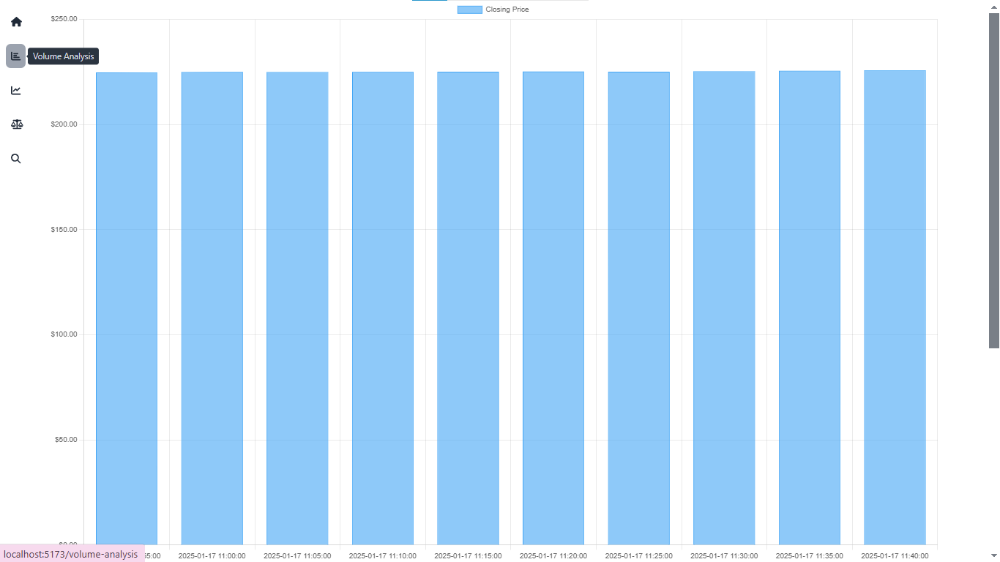  
*Bar chart illustrating recent stock closing prices with the light theme.*

#### **Bubble Chart**
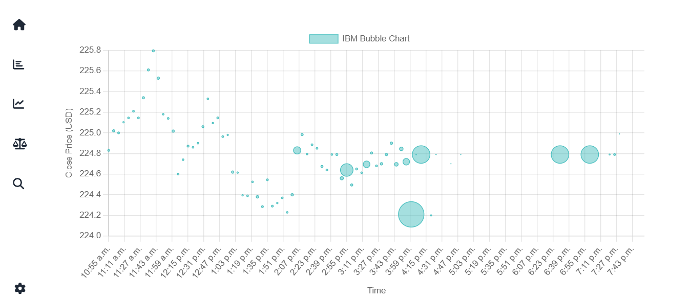  
*Bubble chart showing multi-variable correlations with the light theme.*

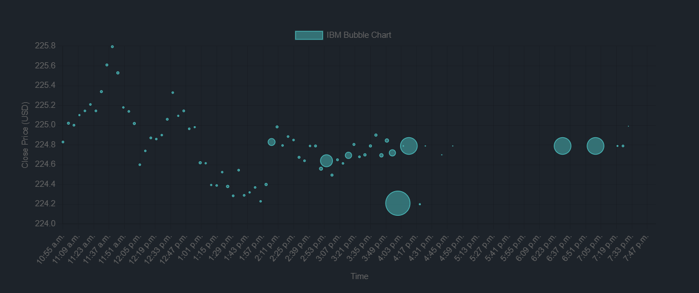  
*Bubble chart with the dark theme.*

#### **Mix of Charts**
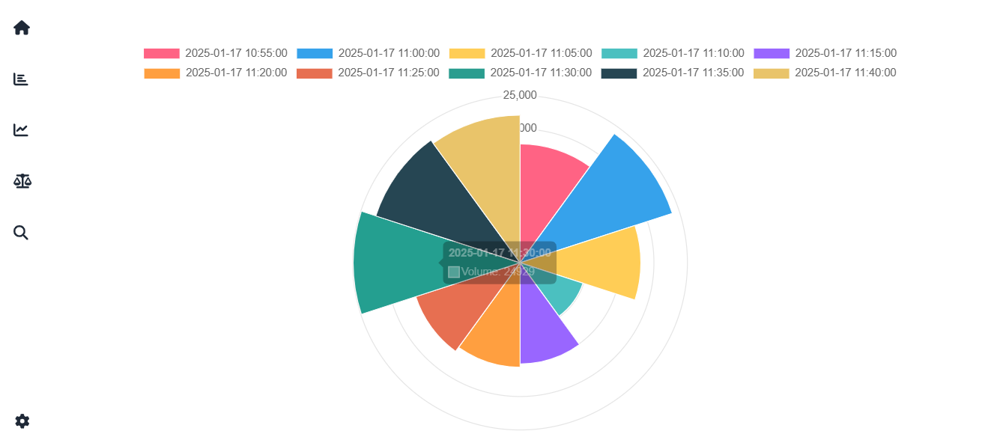  
*A combination of charts illustrating different stock data analysis with the light theme.*

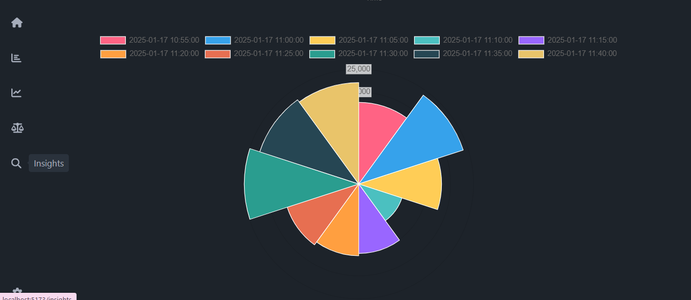  
*A combination of charts with the dark theme.*

#### **Point Chart**
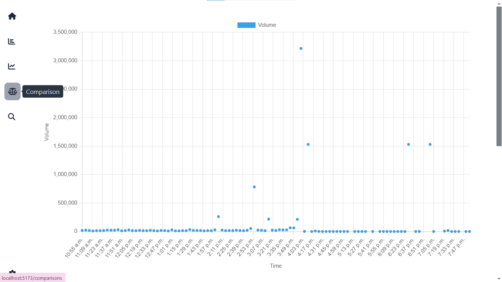  
*Point chart displaying stock volume over time with the light theme.*

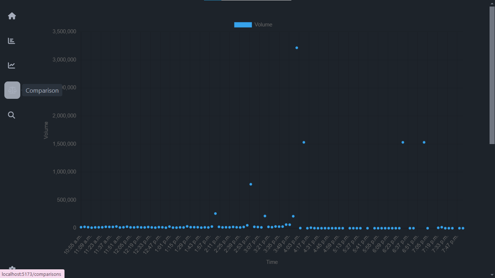  
*Point chart with the dark theme.*

#### **Other Charts**
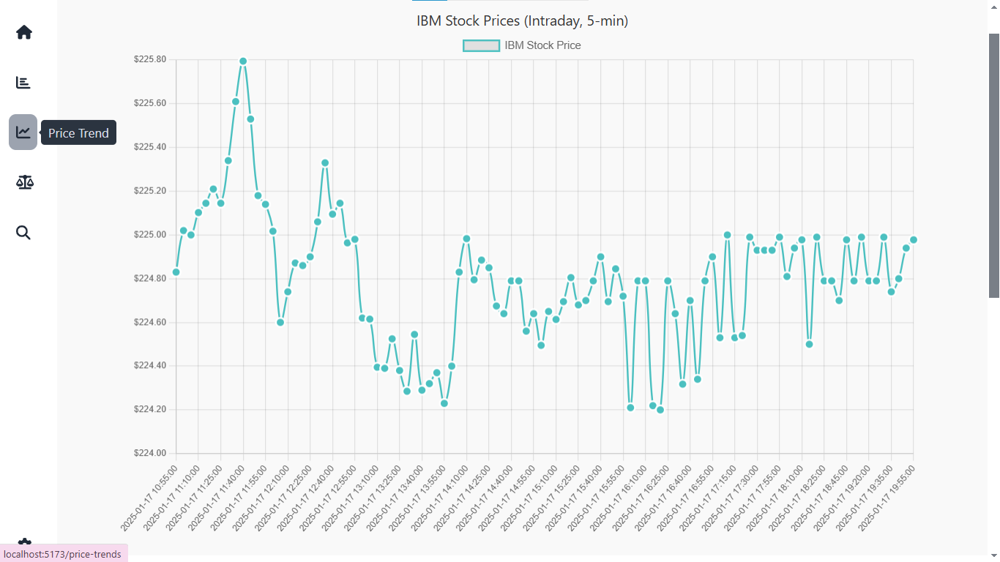  
*A specific chart visualizing stock performance with the light theme.*

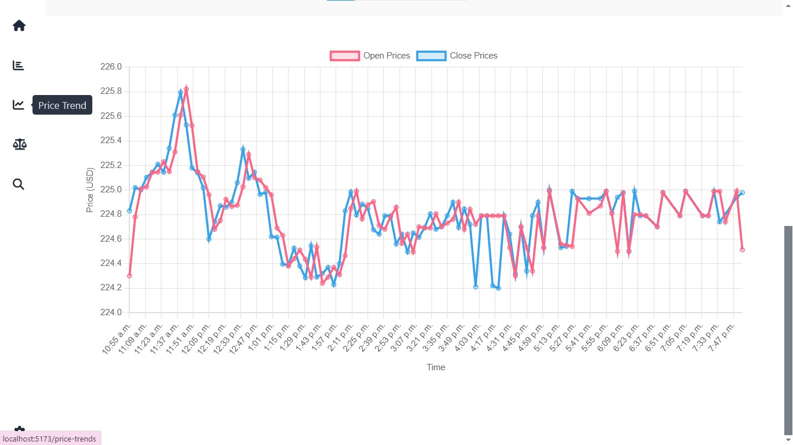  
*Chart with a red-blue color scheme in the light theme.*

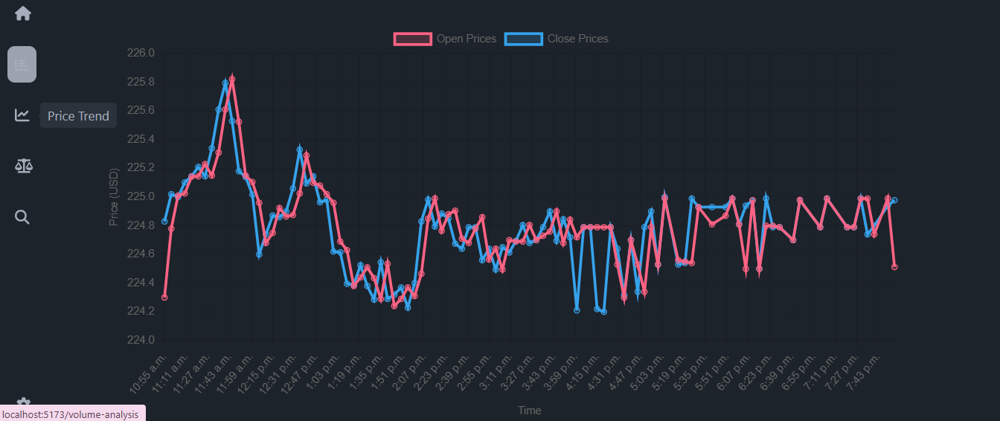  
*The same red-blue chart, but in the dark theme.*

### **Settings**
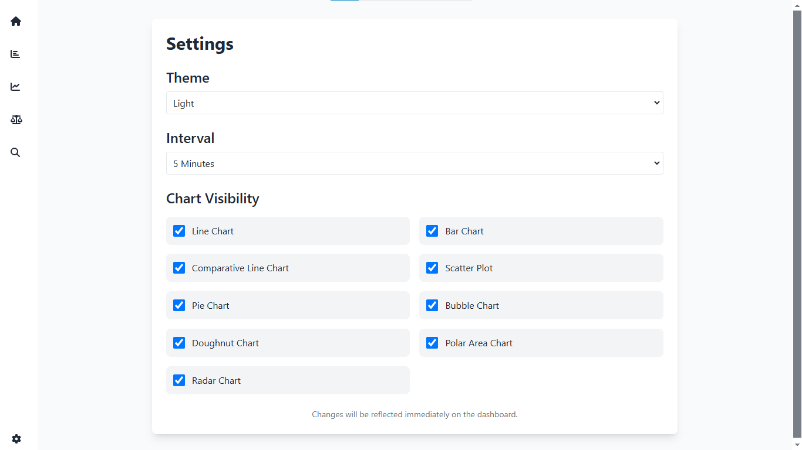  
*Settings page for configuring user preferences and theme options.*

